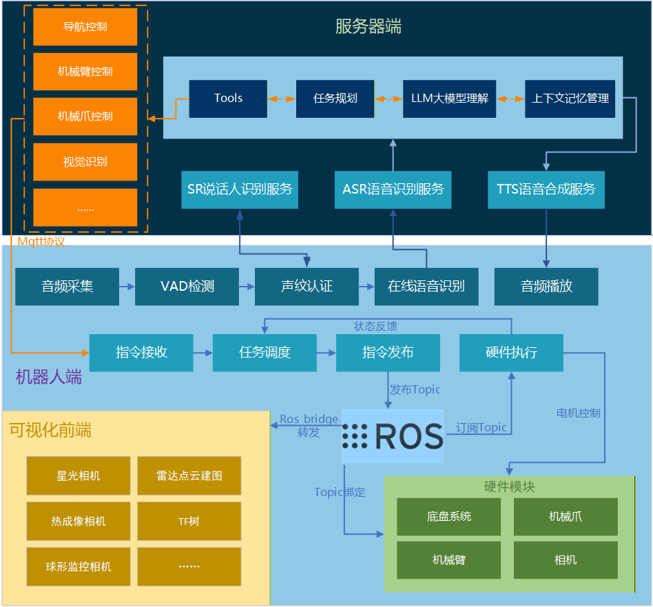

# 语音控制智能机器人系统 - 全流程技术文档

## 1. 系统概述

### 1.1 系统简介

本系统是一个基于语音交互的智能服务机器人系统，支持自然语言对话、声纹识别认证、智能导航和机械臂控制等功能。系统采用分布式架构，包含机器人端和服务端两部分，通过HTTP和MQTT协议进行通信。

### 1.2 核心功能

- **语音交互**：实时语音识别（ASR）和语音合成（TTS）
- **声纹认证**：基于声纹特征的用户身份识别和注册
- **智能对话**：基于大语言模型的自然对话能力
- **工具调用**：支持导航、机械臂控制、夹爪控制等机器人操作
- **任务管理**：MQTT消息队列管理，确保任务有序执行

### 1.3 技术栈

| 组件 | 技术选型 |
|------|---------|
| 语音活动检测 | Silero VAD |
| 语音识别 | 腾讯云ASR SDK |
| 语音合成 | 腾讯云TTS SDK |
| 声纹识别 | WeSpeaker |
| 大语言模型 | LangChain + OpenAI API兼容接口 |
| 通信协议 | HTTP (Flask) + MQTT |
| 机器人框架 | ROS (Robot Operating System) |
| 音频处理 | PyAudio + NumPy + SciPy |

---

## 2. 系统架构

### 2.1 架构图

#### 2.1.1 整体架构



### 2.2 模块说明

#### 2.2.1 机器人端模块

**pipeline.py - 语音交互主程序**
- 功能：实时麦克风监听、VAD语音检测、语音识别调用、TTS播放
- 运行位置：机器人端
- 依赖服务：voice_services.py、http_agent_server.py

**mqtt_manager.py - 任务执行管理器**
- 功能：接收MQTT指令、转换为ROS话题、管理任务队列
- 运行位置：机器人端（ROS环境）
- 依赖：ROS、MQTT Broker

#### 2.2.2 服务端模块

**voice_services.py - 统一语音服务**
- 功能：提供ASR、TTS、声纹识别/认证服务
- 端口：4999（默认）
- API：Flask RESTful API

**http_agent_server.py - AI Agent服务**
- 功能：提供兼容OpenAI API的LLM推理服务，集成工具调用
- 端口：5000（默认）
- API：兼容OpenAI API格式

**robot_tools.py - 机器人控制工具库**
- 功能：提供导航、机械臂、夹爪等控制工具
- 调用方式：被http_agent_server.py作为LangChain工具加载
- 通信方式：通过MQTT发送控制指令

---

## 3. 核心流程详解

### 3.1 用户对话完整流程

```
用户说话
   ↓
[1] 音频采集模块 (pipeline.py)
   ├─ 音频采集：PyAudio实时采集音频 (16kHz, Float32)
   ├─ VAD模块：Silero VAD检测语音活动
   └─ 语音捕获：捕获完整语音片段
   ↓
[2] ASR服务 (voice_services.py)
   ├─ 接收：Base64编码的WAV音频
   ├─ 识别：调用腾讯云ASR API
   └─ 返回：识别文本
   ↓
[3] 指令检查模块 (pipeline.py)
   ├─ 是否包含"注册新用户"?
   │  └─ 是 → 进入注册模式
   └─ 否 → 继续正常流程
   ↓
[4] 声纹认证服务 (可选, voice_services.py)
   ├─ 特征提取：WeSpeaker提取声纹特征
   ├─ 相似度比对：与数据库中注册用户比对
   └─ 返回：认证结果（用户ID + 置信度）
   ↓
[5] LLM推理引擎 (http_agent_server.py)
   ├─ 接收：识别文本
   ├─ 上下文：构建对话历史
   ├─ 推理：LLM生成回复
   └─ 工具调用：可能触发工具执行
   ↓
[6] 工具执行模块 (robot_tools.py, 如果需要)
   ├─ 工具选择：识别需要调用的工具
   ├─ 指令发送：通过MQTT发送控制指令
   └─ 结果返回：返回执行结果
   ↓
[7] TTS服务 (voice_services.py)
   ├─ 接收：回复文本
   ├─ 合成：调用腾讯云TTS API
   └─ 返回：Base64编码的音频
   ↓
[8] 音频播放模块 (pipeline.py)
   └─ 播放：PyAudio播放合成语音
```

### 3.2 机器人控制流程

```
用户: "去办公室拿水瓶"
   ↓
[1] ASR模块 → "去办公室拿水瓶"
   ↓
[2] LLM推理引擎
   ├─ 意图识别：识别地点(office) + 动作(拿取)
   ├─ 工具选择：get_water_bottle()
   └─ 参数提取：提取相关参数
   ↓
[3] 工具执行模块 (robot_tools.py)
   ├─ 函数调用：get_water_bottle()
   ├─ MQTT连接：连接MQTT Broker
   └─ 指令序列：按顺序发送指令
       ├─ 步骤0: 夹爪松开指令
       ├─ 步骤1: 机械臂抓取位置指令
       ├─ 步骤2: 夹爪夹紧指令
       └─ 步骤3: 机械臂抬升指令
   ↓
[4] MQTT发布模块
   ├─ Topic: robot/gripper/control
   ├─ Topic: robot/arm/coordinate
   ├─ Topic: robot/gripper/control
   └─ Topic: robot/arm/coordinate
   ↓
[5] MQTT接收模块 (mqtt_manager.py)
   ├─ 消息接收：接收MQTT消息
   ├─ 载荷解析：解析JSON payload
   └─ 任务队列管理器：
       ├─ 任务入队：添加到任务队列
       └─ 顺序执行：按序执行任务
   ↓
[6] ROS话题发布模块
   ├─ /cmdeffector (夹爪控制)
   ├─ /arm_drive (机械臂控制)
   └─ /move_base_simple/goal (导航控制)
   ↓
[7] 硬件执行模块
   ├─ 导航系统：移动到目标位置
   ├─ 机械臂系统：移动到指定坐标
   └─ 夹爪系统：执行抓取动作
   ↓
[8] 状态监控模块
   ├─ 导航状态：订阅 /navigation_status
   ├─ 机械臂状态：订阅 /arm_status
   └─ 完成检测：任务完成状态判断
   ↓
[9] 音频播放模块
   └─ TTS回复："已成功完成拿水瓶任务"
```

### 3.3 声纹注册流程

```
用户: "注册新用户"
   ↓
[1] ASR模块
   └─ 关键词检测：检测到 "注册新用户"
   ↓
[2] 注册模式控制模块 (pipeline.py)
   ├─ 状态切换：设置 is_register_mode = True
   ├─ ID生成：生成用户ID (user_<timestamp>)
   └─ 语音提示：TTS提示 "请说一段话用于注册，您的用户ID是..."
   ↓
[3] 音频采集模块 (注册语音)
   ├─ VAD模块：捕获语音
   ├─ ASR模块：识别(仅用于确认)
   └─ 音频编码：转换为Base64格式
   ↓
[4] 声纹注册服务 (voice_services.py)
   ├─ 特征提取：WeSpeaker提取声纹特征向量
   ├─ 数据存储：保存到数据库 (speaker_db/{user_id}.npy)
   └─ 结果返回：返回注册结果
   ↓
[5] 注册模式退出 (pipeline.py)
   ├─ 状态重置：is_register_mode = False
   ├─ ID清除：pending_register_id = None
   └─ 结果播报：TTS反馈注册结果
```

---

## 4. 关键技术实现

### 4.1 语音活动检测 (VAD)

**技术方案：Silero VAD**

```python
# 模型加载
model = load_silero_vad(onnx=True)
vad_iterator = VADIterator(
    model,
    threshold=0.5,              # 语音置信度阈值
    sampling_rate=16000,        # 采样率
    min_silence_duration_ms=300,# 最小静音时长
    speech_pad_ms=100           # 语音前后填充
)

# 实时检测
speech_dict = vad_iterator(audio_chunk, return_seconds=False)
if 'start' in speech_dict:
    # 检测到语音开始
    is_speaking = True
if 'end' in speech_dict:
    # 检测到语音结束
    is_speaking = False
```

**特点：**
- 低延迟：实时检测，延迟小于100ms
- 高精度：有效过滤环境噪音
- 自动端点检测：自动识别语音起止点

### 4.2 声纹识别

**技术方案：WeSpeaker**

**注册过程：**
```python
# 1. 接收音频（Base64 WAV）
# 2. 提取声纹特征向量
# 3. 保存到本地数据库
spk.register(user_id, audio_base64)
# 存储路径: speaker_db/{user_id}.npy
```

**认证过程：**
```python
# 1. 提取当前音频的声纹特征
# 2. 与数据库中所有注册用户比对
# 3. 计算相似度（余弦相似度）
# 4. 返回最匹配用户及置信度
result = spk.recognize(audio_base64)
# 返回: {"name": user_id, "confidence": 0.85}
```

**阈值策略：**
- 默认阈值：0.62
- confidence >= 0.62 → 认证通过
- confidence < 0.62 → 返回 UNREGISTERED

### 4.3 任务队列管理

**设计目标：**
- 确保任务有序执行
- 避免指令冲突
- 支持任务状态监控
- 异常情况自动暂停

**实现机制：**

```python
class NavigationManager:
    def __init__(self):
        self.task_queue = deque()      # 任务队列
        self.current_task = None        # 当前执行任务
        self.task_paused = False        # 暂停标志
        self.task_completion_delay = 0.5 # 任务间隔
```

**任务执行流程：**

1. **任务添加**
```python
def add_task(self, task_type, payload):
    if self.task_paused:
        return False
    task = Task(task_type, payload)
    self.task_queue.append(task)
```

2. **任务执行**
```python
def _task_executor(self):
    while not rospy.is_shutdown():
        if self.current_task is not None:
            if self._is_task_completed(self.current_task):
                # 任务完成，等待延迟后执行下一个
                self.task_completion_time = time.time()
                self.current_task = None
        
        if self.task_queue:
            self.current_task = self.task_queue.popleft()
            self._execute_task(self.current_task)
```

3. **任务完成检测**
- **导航任务**：监听 `/navigation_status` 话题
  - status == 2 → 导航完成
  - status == 1 → 导航异常（暂停队列）
  - status == 4 → 手柄控制（暂停队列）

- **机械臂任务**：监听 `/arm_status` 话题
  - running_status == False → 任务完成

- **夹爪任务**：固定延迟（1.5秒）

### 4.4 AI Agent工具调用

**工具定义示例：**

```python
def go_to_office() -> dict:
    """导航到办公室"""
    # 1. 加载坐标配置
    locations = _load_locations_config()
    pos = locations.get("office", {})
    
    # 2. 连接MQTT
    client = connect_mqtt()
    
    # 3. 发送导航指令
    success = _send_navigation(
        client, 
        MQTT_TOPIC_NAVIGATION, 
        x, y, z, orientation
    )
    
    # 4. 返回结果
    return _result(True, "已发送前往办公室的导航指令")
```

**工具注册：**

```python
GoToOfficeTool = StructuredTool.from_function(
    go_to_office,
    name="go_to_office",
    description=(
        "仅在用户明确表达要前往办公室时使用，"
        "例如 去办公室 或 到办公室。"
    )
)
```

**Agent配置：**

```python
agent = initialize_agent(
    tools,
    llm,
    agent=AgentType.STRUCTURED_CHAT_ZERO_SHOT_REACT_DESCRIPTION,
    verbose=False,
    handle_parsing_errors=True,
    return_intermediate_steps=True
)
```

### 4.5 音频反馈抑制

**问题：** TTS播放时麦克风可能捕获扬声器输出，导致回声循环

**解决方案：**

```python
# 1. 播放标志
is_playing_tts = False
playback_lock = threading.Lock()

# 2. 播放时设置标志
def play_audio_from_base64(audio_base64_str):
    with playback_lock:
        is_playing_tts = True
        # ... 播放音频 ...
        is_playing_tts = False

# 3. VAD检测时跳过
def main_loop():
    while stream.is_active():
        chunk = audio_queue.get()
        
        if is_playing_tts:
            continue  # 播放时不处理麦克风输入
        
        speech_dict = vad_iterator(chunk)
```

---

## 5. 通信协议

### 5.1 HTTP API

#### 5.1.1 ASR服务

**端点：** `POST /asr/recognize`

**请求：**
```json
{
  "audio_base64": "UklGRiQAAABXQVZFZm10..."
}
```

**响应：**
```json
{
  "success": true,
  "result": "去办公室拿水瓶",
  "request_id": "xxx",
  "duration": 3.5
}
```

#### 5.1.2 TTS服务

**端点：** `POST /tts/synthesize`

**请求：**
```json
{
  "text": "好的，我现在去办公室拿水瓶",
  "voice_type": 101001,
  "sample_rate": 16000,
  "codec": "wav"
}
```

**响应：**
```json
{
  "success": true,
  "audio_base64": "UklGRiQAAABXQVZFZm10...",
  "sample_rate": 16000,
  "codec": "wav"
}
```

#### 5.1.3 声纹注册

**端点：** `POST /speaker/register`

**请求：**
```json
{
  "id": "user_1699876543",
  "audio_base64": "UklGRiQAAABXQVZFZm10..."
}
```

**响应：**
```json
{
  "success": true,
  "id": "user_1699876543",
  "path": "/path/to/speaker_db/user_1699876543.npy"
}
```

#### 5.1.4 声纹认证

**端点：** `POST /speaker/verify`

**请求：**
```json
{
  "audio_base64": "UklGRiQAAABXQVZFZm10...",
  "threshold": 0.62
}
```

**响应：**
```json
{
  "success": true,
  "id": "user_1699876543",
  "confidence": 0.85,
  "threshold": 0.62,
  "registered": true
}
```

#### 5.1.5 AI Agent - Completions

**端点：** `POST /v1/completions`

**请求：**
```json
{
  "prompt": "Human: 去办公室拿水瓶\nAssistant:",
  "stop": ["\n\n", "Human:", "Assistant:"]
}
```

**响应：**
```json
{
  "choices": [
    {
      "text": "好的，我现在去办公室拿水瓶",
      "index": 0,
      "finish_reason": "stop"
    }
  ],
  "usage": {...},
  "model": "local-agent"
}
```

### 5.2 MQTT协议

**Broker配置：**
- 地址：10.194.142.104（服务端发送）/ 127.0.0.1（机器人端接收）
- 端口：1883
- QoS：1（至少一次）

#### 5.2.1 导航指令

**Topic：** `robot/navigation`

**Payload：**
```json
{
  "x": 96.089,
  "y": 97.930,
  "z": 0.0,
  "orientation": {
    "x": 0.0,
    "y": 0.0,
    "z": 0.046,
    "w": -0.998
  }
}
```

#### 5.2.2 机械臂命令指令

**Topic：** `robot/arm/control`

**Payload：**
```json
{
  "command": 1
}
```

**命令说明：**
- 0: 回到原位
- 1: 夹取姿态
- 2: 释放姿态
- 3: 搬运姿态

#### 5.2.3 机械臂坐标指令

**Topic：** `robot/arm/coordinate`

**Payload：**
```json
{
  "x": -82.524,
  "y": -36.584,
  "z": -85.549,
  "rx": 93.457,
  "ry": 88.242,
  "rz": 4.331
}
```

#### 5.2.4 夹爪控制指令

**Topic：** `robot/gripper/control`

**Payload：**
```json
{
  "command": 1
}
```

**命令说明：**
- 1: 夹紧
- 2: 松开

---

## 6. 配置说明

### 6.1 环境变量配置

**voice_services.py 需要的环境变量：**

```bash
# 腾讯云密钥
export TENCENTCLOUD_SECRET_ID="your_secret_id"
export TENCENTCLOUD_SECRET_KEY="your_secret_key"

# 声纹识别配置
export SPEAKER_MODEL_DIR="/home/lxc/.wespeaker/chinese"
export SPEAKER_DB_DIR="./speaker_db"
export SPEAKER_THRESHOLD="0.62"
export SPEAKER_DEVICE="cuda:0"
export SPEAKER_UNREGISTERED_ID="UNREGISTERED"

# Flask服务配置
export FLASK_HOST="0.0.0.0"
export FLASK_PORT="4999"
```

**pipeline.py 配置项：**

```python
# 服务器地址
VOICE_SERVER_IP = "202.38.214.151"
VOICE_SERVER_PORT = 4999
LLM_SERVER_IP = "202.38.214.151"
LLM_SERVER_PORT = 5000

# VAD参数
VAD_THRESHOLD = 0.5
MIN_SILENCE_DURATION_MS = 300
SPEECH_PAD_MS = 100

# 声纹认证开关
ENABLE_SPEAKER_AUTH = os.getenv("ENABLE_SPEAKER_AUTH", "false").lower() == "true"
```

**http_agent_server.py 启动参数：**

```bash
python http_agent_server.py \
  --host 0.0.0.0 \
  --port 5000 \
  --llm-endpoint http://localhost:8000/v1 \
  --debug
```

### 6.2 ROS配置

**mqtt_manager.py 需要的ROS话题：**

**发布话题：**
- `/move_base_simple/goal` (geometry_msgs/PoseStamped) - 导航目标
- `/arm_drive` (imrobot_msg/ArmDrive) - 机械臂控制
- `/cmdeffector` (std_msgs/Int32) - 夹爪控制

**订阅话题：**
- `/navigation_status` (navigation_msgs/NavigationStatus) - 导航状态
- `/arm_status` (imrobot_msg/ArmStatus) - 机械臂状态

### 6.3 位置坐标配置

**config/locations.json：**

```json
{
  "office": {
    "x": 74.814,
    "y": 77.791,
    "z": 0.0,
    "orientation": {
      "x": 0.0,
      "y": 0.0,
      "z": 0.0,
      "w": 1.0
    }
  },
  "restroom": {
    "x": 86.846,
    "y": 92.542,
    "z": 0.0
  },
  "corridor": {
    "x": 97.678,
    "y": 90.035,
    "z": 0.0
  }
}
```

---

## 7. 部署指南

### 7.1 服务端部署

**1. 安装依赖**

```bash
# Python依赖
pip install flask flask-cors
pip install langchain langchain-openai langchain-core
pip install paho-mqtt
pip install tencentcloud-sdk-python
pip install wespeaker

# 腾讯云SDK
pip install tencentcloud-sdk-python-asr
pip install tencentcloud-sdk-python-tts
```

**2. 启动语音服务**

```bash
# 设置环境变量
export TENCENTCLOUD_SECRET_ID="your_id"
export TENCENTCLOUD_SECRET_KEY="your_key"

# 启动服务
python voice_services.py
# 监听 0.0.0.0:4999
```

**3. 启动Agent服务**

```bash
python http_agent_server.py \
  --host 0.0.0.0 \
  --port 5000 \
  --llm-endpoint http://localhost:8000/v1
# 监听 0.0.0.0:5000
```

**4. 启动MQTT Broker**

```bash
# 安装mosquitto
sudo apt-get install mosquitto mosquitto-clients

# 启动broker
mosquitto -v -p 1883
```

### 7.2 机器人端部署

**1. 安装ROS依赖**

```bash
# 安装ROS (假设已安装)
# 安装自定义消息包
sudo apt-get install ros-noetic-navigation-msgs
# 安装自定义包 imrobot_msg
```

**2. 安装Python依赖**

```bash
pip install pyaudio numpy scipy
pip install silero-vad
pip install paho-mqtt requests
```

**3. 启动MQTT管理器**

```bash
# 在ROS环境中
rosrun your_package mqtt_manager.py
```

**4. 启动语音监听程序**

```bash
# 可选：启用声纹认证
export ENABLE_SPEAKER_AUTH="true"

# 启动
python pipeline.py
```

### 7.3 网络配置

**防火墙规则：**

```bash
# 服务端开放端口
sudo ufw allow 4999/tcp  # voice_services
sudo ufw allow 5000/tcp  # http_agent_server
sudo ufw allow 1883/tcp  # MQTT broker

# 机器人端确保可以访问服务端IP
ping 202.38.214.151
```

---

## 8. 故障排查

### 8.1 常见问题

#### 问题1: ASR/TTS服务调用失败

**症状：**
```
❌ ASR服务器响应错误 (401)
```

**解决方案：**
1. 检查腾讯云密钥是否正确
2. 确认账户余额是否充足
3. 检查网络连接

#### 问题2: MQTT连接失败

**症状：**
```
❌ MQTT连接失败: Connection refused
```

**解决方案：**
1. 确认MQTT Broker已启动
2. 检查IP地址和端口配置
3. 检查防火墙规则

#### 问题3: 机器人不执行指令

**症状：**
```
已发送导航指令，但机器人没有移动
```

**解决方案：**
1. 检查ROS话题是否正常：`rostopic list`
2. 查看mqtt_manager日志
3. 确认机器人不在手柄控制模式
4. 检查任务队列是否被暂停

#### 问题4: 音频播放时产生回声

**症状：**
机器人说话时会自己识别自己的声音

**解决方案：**
1. 确认 `is_playing_tts` 标志工作正常
2. 降低扬声器音量
3. 增大麦克风与扬声器距离
4. 调整VAD阈值

### 8.2 日志分析

**pipeline.py 关键日志：**

```
🗣️ 识别结果: 去办公室拿水瓶
🧠 思考中...
🤖 回复: 好的，我现在去办公室拿水瓶
🔊 播放回复中...
```

**mqtt_manager.py 关键日志：**

```
任务已加入队列: Task(type=navigation), 当前队列长度: 1
开始执行任务: Task(type=navigation), 剩余任务: 0
发布导航目标: (96.089, 97.930, 0.0)
当前导航状态: 3 (正在导航)
导航任务已完成
```

**robot_tools.py 关键日志：**

```
🛠️ 工具 get_water_bottle 开始执行
步骤0: 松开夹爪
步骤2: 机械臂移动到水瓶抓取位置
步骤3: 夹爪夹取水瓶
步骤4: 机械臂回到搬运姿态
✅ 工具执行完成
```

---

## 9. 性能指标

### 9.1 响应时间

| 操作 | 平均耗时 | 备注 |
|------|---------|------|
| VAD语音检测 | <100ms | 实时检测 |
| ASR识别 | 1-3s | 取决于音频长度 |
| 声纹认证 | <500ms | 本地计算 |
| LLM推理 | 2-5s | 取决于模型大小 |
| TTS合成 | 1-2s | 取决于文本长度 |
| MQTT传输 | <50ms | 本地网络 |
| 完整对话周期 | 5-12s | 从说话到播放回复 |

### 9.2 资源消耗

**服务端：**
- voice_services.py: ~500MB内存（含声纹模型）
- http_agent_server.py: ~1GB内存（含LLM）
- CPU: 取决于LLM推理

**机器人端：**
- pipeline.py: ~300MB内存
- mqtt_manager.py: ~50MB内存
- CPU: 10-20%（音频处理）

---

## 10. 未来优化方向

### 10.1 功能增强

1. **多轮对话管理**
   - 实现对话上下文管理
   - 支持澄清性问题
   - 任务中断与恢复

2. **视觉融合**
   - 集成视觉识别
   - 物体检测与定位
   - 人脸识别辅助声纹认证

3. **任务规划**
   - 复杂任务自动拆解
   - 多步骤任务规划
   - 异常恢复策略

### 10.2 性能优化

1. **降低延迟**
   - 流式ASR
   - 流式TTS
   - LLM推理加速

2. **提高准确率**
   - 优化VAD参数
   - 声纹模型微调
   - 提示词工程优化

3. **资源优化**
   - 模型量化
   - 批处理优化
   - 缓存策略

---

## 11. 附录

### 11.1 参考文档

- [Silero VAD](https://github.com/snakers4/silero-vad)
- [WeSpeaker](https://github.com/wenet-e2e/wespeaker)
- [LangChain](https://python.langchain.com/)
- [ROS Wiki](http://wiki.ros.org/)
- [MQTT协议](https://mqtt.org/)

### 11.2 工具清单

| 工具名称 | 功能 | 调用条件 |
|---------|------|---------|
| go_to_office | 导航到办公室 | 用户说"去办公室" |
| go_to_restroom | 导航到休息室 | 用户说"去休息室" |
| go_to_corridor | 导航到走廊 | 用户说"去走廊" |
| arm_control | 机械臂姿态控制 | 用户说"机械臂归位/准备/搬运" |
| gripper_control | 夹爪开合控制 | 用户说"夹紧/松开" |
| complex_task | 导航+机械臂组合 | 用户说"去XX拿YY" |
| get_water_bottle | 完整拿水瓶流程 | 用户说"拿水瓶" |

### 11.3 错误码说明

**HTTP状态码：**
- 200: 成功
- 400: 请求参数错误
- 500: 服务器内部错误

**导航状态码：**
- 1: 导航异常
- 2: 导航完成/正常
- 3: 正在导航
- 4: 手柄控制模式

---

**文档版本：** v1.0  
**最后更新：** 2025-11-05  
**维护者：** AI Agent Team

