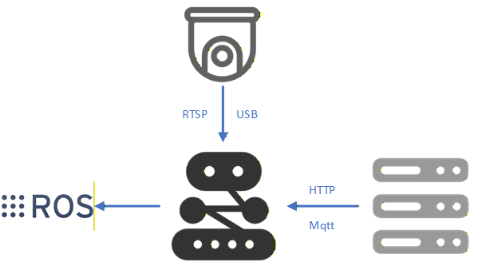

# 语音控制智能机器人系统 - 接口规范

## 1. 文档说明

### 1.1 目的

本文档旨在规范化系统内所有模块间的接口通信格式，确保：
- 接口定义清晰、一致、易于维护
- 通信协议标准化
- 错误处理统一
- 问题排查高效

### 1.2 适用范围

- 机器人端：pipeline.py, mqtt_manager.py
- 服务端：voice_services.py, http_agent_server.py, robot_tools.py
- 通信协议：HTTP RESTful API, MQTT




### 1.3 版本历史

| 版本 | 日期 | 修订内容 | 作者 |
|-----|------|---------|------|
| v1.0 | 2025-11-05 | 初始版本 | enemy1205@qq.com |
| v1.1 | 2025-11-19 | 日志接口分离 | enemy1205@qq.com |

---

## 2. HTTP接口规范

### 2.1 通用规范

#### 2.1.1 基本原则

1. **RESTful设计**：使用标准HTTP方法（GET, POST, PUT, DELETE）
2. **JSON格式**：请求和响应统一使用JSON格式
3. **UTF-8编码**：所有文本内容使用UTF-8编码
4. **状态码语义化**：正确使用HTTP状态码
5. **错误处理统一**：错误响应格式一致

#### 2.1.2 请求头规范

**必需请求头：**
```http
Content-Type: application/json
Accept: application/json
```

**可选请求头：**
```http
X-Request-ID: <唯一请求标识>
User-Agent: <客户端标识>
```

#### 2.1.3 响应格式规范

**成功响应格式：**

```json
{
  "success": true,
  "data": {
    // 实际数据
  },
  "message": "操作成功",
  "timestamp": "2025-11-05T10:30:00Z",
  "request_id": "req_1699876543"
}
```

**错误响应格式：**

```json
{
  "success": false,
  "error": {
    "code": "ERROR_CODE",
    "message": "错误描述信息",
    "details": "详细错误信息（可选）"
  },
  "timestamp": "2025-11-05T10:30:00Z",
  "request_id": "req_1699876543"
}
```

#### 2.1.4 HTTP状态码使用规范

| 状态码 | 含义 | 使用场景 |
|-------|------|----------|
| 200 | OK | 请求成功 |
| 400 | Bad Request | 请求参数错误、格式错误 |
| 401 | Unauthorized | 认证失败 |
| 403 | Forbidden | 权限不足 |
| 404 | Not Found | 资源不存在 |
| 500 | Internal Server Error | 服务器内部错误 |
| 503 | Service Unavailable | 服务暂时不可用 |

---

### 2.2 语音服务接口规范 (voice_services.py)

**基础URL：** `http://{VOICE_SERVER_IP}:{VOICE_SERVER_PORT}`

#### 2.2.1 健康检查

**端点：** `GET /`

**功能：** 服务健康状态检查

**请求示例：**
```http
GET / HTTP/1.1
Host: 202.38.214.151:4999
```

**响应示例：**
```json
{
  "message": "统一语音服务节点已启动",
  "status": "OK",
  "endpoints": {
    "asr": "/asr/recognize",
    "tts": "/tts/synthesize",
    "speaker_register": "/speaker/register",
    "speaker_verify": "/speaker/verify"
  }
}
```

**状态码：**
- 200: 服务正常

---

#### 2.2.2 语音识别 (ASR)

**端点：** `POST /asr/recognize`

**功能：** 将音频数据转换为文字

**请求参数：**

| 参数名 | 类型 | 必需 | 说明 |
|-------|------|------|------|
| audio_base64 | string | 是 | Base64编码的WAV音频数据 |

**请求示例：**
```json
{
  "audio_base64": "UklGRiQAAABXQVZFZm10IBAAAAABAAEA..."
}
```

**音频要求：**
- 格式：WAV (PCM)
- 采样率：16000 Hz
- 声道：单声道 (Mono)
- 位深度：16-bit
- 编码：Base64

**成功响应：**
```json
{
  "success": true,
  "result": "去办公室拿水瓶",
  "request_id": "asr_1699876543",
  "duration": 3.5
}
```

**响应字段说明：**
- `success`: 布尔值，是否识别成功
- `result`: 字符串，识别结果文本
- `request_id`: 字符串，请求唯一标识
- `duration`: 浮点数，音频时长（秒），可选

**错误响应：**
```json
{
  "success": false,
  "error": "缺少 'audio_base64' 字段"
}
```

**状态码：**
- 200: 识别成功（success=true）或识别失败（success=false）
- 400: 请求参数错误
- 500: 服务器内部错误

**错误码：**
- `MISSING_AUDIO`: 缺少音频数据
- `INVALID_AUDIO_FORMAT`: 音频格式错误
- `ASR_SERVICE_ERROR`: ASR服务调用失败
- `DECODE_ERROR`: Base64解码失败

---

#### 2.2.3 语音合成 (TTS)

**端点：** `POST /tts/synthesize`

**功能：** 将文字转换为语音

**请求参数：**

| 参数名 | 类型 | 必需 | 默认值 | 说明 |
|-------|------|------|--------|------|
| text | string | 是 | - | 要合成的文本 |
| voice_type | int | 否 | 101001 | 音色类型 |
| primary_language | int | 否 | 1 | 主要语言（1=中文） |
| sample_rate | int | 否 | 16000 | 采样率 |
| speed | int | 否 | 0 | 语速（-2~6） |
| codec | string | 否 | "wav" | 编码格式（wav/mp3/pcm） |

**请求示例：**
```json
{
  "text": "好的，我现在去办公室拿水瓶",
  "voice_type": 101001,
  "sample_rate": 16000,
  "speed": 0,
  "codec": "wav"
}
```

**音色类型参考：**
- 101001: 智瑜（女声，通用）
- 101002: 智聆（女声，客服）
- 101003: 智美（女声，温柔）
- 更多参考腾讯云TTS文档

**成功响应：**
```json
{
  "success": true,
  "message": "语音合成成功",
  "audio_base64": "UklGRiQAAABXQVZFZm10IBAAAAABAAEA...",
  "session_id": "tts_service_1699876543000",
  "sample_rate": 16000,
  "codec": "wav"
}
```

**响应字段说明：**
- `success`: 布尔值，是否合成成功
- `message`: 字符串，操作结果描述
- `audio_base64`: 字符串，Base64编码的音频数据
- `session_id`: 字符串，会话唯一标识
- `sample_rate`: 整数，采样率
- `codec`: 字符串，音频编码格式

**错误响应：**
```json
{
  "success": false,
  "error": "请求中缺少 'text' 字段或文本为空"
}
```

**状态码：**
- 200: 合成成功
- 400: 请求参数错误
- 500: 服务器内部错误

**错误码：**
- `MISSING_TEXT`: 缺少文本内容
- `INVALID_CODEC`: 不支持的编码格式
- `TTS_SERVICE_ERROR`: TTS服务调用失败

---

#### 2.2.4 声纹注册

**端点：** `POST /speaker/register`

**功能：** 注册用户声纹特征

**请求参数：**

| 参数名 | 类型 | 必需 | 说明 |
|-------|------|------|------|
| id | string | 是 | 用户唯一标识 |
| audio_base64 | string | 是 | Base64编码的音频数据 |

**请求示例：**
```json
{
  "id": "user_1699876543",
  "audio_base64": "UklGRiQAAABXQVZFZm10IBAAAAABAAEA..."
}
```

**音频要求：**
- 时长：建议3-5秒
- 内容：清晰的语音（建议朗读固定文本）
- 格式：同ASR要求（WAV, 16kHz, Mono, 16-bit）

**成功响应：**
```json
{
  "success": true,
  "id": "user_1699876543",
  "path": "/path/to/speaker_db/user_1699876543.npy"
}
```

**响应字段说明：**
- `success`: 布尔值，是否注册成功
- `id`: 字符串，用户ID
- `path`: 字符串，声纹特征文件存储路径

**错误响应：**
```json
{
  "success": false,
  "error": "缺少 'id'"
}
```

**状态码：**
- 200: 注册成功
- 400: 请求参数错误
- 500: 服务器内部错误

**错误码：**
- `MISSING_ID`: 缺少用户ID
- `MISSING_AUDIO`: 缺少音频数据
- `DUPLICATE_ID`: 用户ID已存在
- `FEATURE_EXTRACTION_ERROR`: 声纹特征提取失败

---

#### 2.2.5 声纹认证

**端点：** `POST /speaker/verify`

**功能：** 验证用户身份

**请求参数：**

| 参数名 | 类型 | 必需 | 默认值 | 说明 |
|-------|------|------|--------|------|
| audio_base64 | string | 是 | - | Base64编码的音频数据 |
| threshold | float | 否 | 0.62 | 相似度阈值 |

**请求示例：**
```json
{
  "audio_base64": "UklGRiQAAABXQVZFZm10IBAAAAABAAEA...",
  "threshold": 0.62
}
```

**成功响应：**
```json
{
  "success": true,
  "id": "user_1699876543",
  "confidence": 0.85,
  "threshold": 0.62,
  "registered": true
}
```

**响应字段说明：**
- `success`: 布尔值，请求是否成功
- `id`: 字符串，匹配的用户ID（未匹配时为"UNREGISTERED"）
- `confidence`: 浮点数，相似度置信度（0-1）
- `threshold`: 浮点数，使用的阈值
- `registered`: 布尔值，是否通过认证

**未注册用户响应：**
```json
{
  "success": true,
  "id": "UNREGISTERED",
  "confidence": 0.35,
  "threshold": 0.62,
  "registered": false
}
```

**错误响应：**
```json
{
  "success": false,
  "error": "缺少 'audio_base64'"
}
```

**状态码：**
- 200: 认证成功（无论是否匹配）
- 400: 请求参数错误
- 500: 服务器内部错误

**阈值建议：**
- 0.50-0.60: 宽松模式（高召回率）
- 0.60-0.70: 平衡模式（推荐）
- 0.70-0.85: 严格模式（高精确度）

---

### 2.3 AI Agent接口规范 (http_agent_server.py)

**基础URL：** `http://{LLM_SERVER_IP}:{LLM_SERVER_PORT}`

#### 2.3.1 健康检查

**端点：** `GET /health`

**功能：** 服务健康状态检查

**请求示例：**
```http
GET /health HTTP/1.1
Host: 202.38.214.151:5000
```

**响应示例：**
```json
{
  "status": "healthy",
  "message": "HTTP Agent Server正在运行",
  "tools_available": [
    "arm_control",
    "go_to_office",
    "go_to_restroom",
    "go_to_corridor",
    "complex_task",
    "gripper_control",
    "get_water_bottle"
  ]
}
```

**状态码：**
- 200: 服务正常

---

#### 2.3.2 文本补全接口 (Completions)

**端点：** `POST /v1/completions`

**功能：** 兼容OpenAI API的文本补全接口

**请求参数：**

| 参数名 | 类型 | 必需 | 默认值 | 说明 |
|-------|------|------|--------|------|
| prompt | string | 是 | - | 输入提示词 |
| stop | array | 否 | [] | 停止序列 |

**请求示例：**
```json
{
  "prompt": "Human: 去办公室拿水瓶\nAssistant:",
  "stop": ["\n\n", "Human:", "Assistant:"]
}
```

**Prompt格式建议：**

对于对话任务：
```
Human: <用户输入>
Assistant:
```

对于多轮对话：
```
Human: <历史输入1>
Assistant: <历史回复1>
Human: <历史输入2>
Assistant: <历史回复2>
Human: <当前输入>
Assistant:
```

**成功响应：**
```json
{
  "choices": [
    {
      "text": "好的，我现在去办公室拿水瓶\n\n已发送机械臂『夹取』指令",
      "index": 0,
      "finish_reason": "stop"
    }
  ],
  "usage": {
    "prompt_tokens": 15,
    "completion_tokens": 25,
    "total_tokens": 40
  },
  "model": "local-agent",
  "object": "text_completion"
}
```

**响应字段说明：**
- `choices`: 数组，生成的回复列表
  - `text`: 字符串，生成的文本（包含工具执行结果）
  - `index`: 整数，回复索引
  - `finish_reason`: 字符串，结束原因（stop/length/error）
- `usage`: 对象，token使用统计
- `model`: 字符串，模型标识
- `object`: 字符串，对象类型标识

**工具调用响应示例：**

当Agent调用了工具时，响应的text字段会包含工具执行结果：

```json
{
  "choices": [
    {
      "text": "好的，我现在去办公室拿水瓶\n\n已发送前往『办公室』的导航指令\n已发送机械臂『夹取』指令",
      "index": 0,
      "finish_reason": "stop"
    }
  ]
}
```

**错误响应：**
```json
{
  "error": "未提供prompt",
  "choices": [
    {
      "text": "抱歉，处理您的请求时出现错误：未提供prompt",
      "index": 0,
      "finish_reason": "error"
    }
  ]
}
```

**状态码：**
- 200: 请求成功
- 400: 请求参数错误
- 500: 服务器内部错误

---

#### 2.3.3 聊天补全接口 (Chat Completions)

**端点：** `POST /v1/chat/completions`

**功能：** 兼容OpenAI API的聊天补全接口

**请求参数：**

| 参数名 | 类型 | 必需 | 说明 |
|-------|------|------|------|
| messages | array | 是 | 消息列表 |

**消息格式：**
```json
{
  "role": "user|assistant|system",
  "content": "消息内容"
}
```

**请求示例：**
```json
{
  "messages": [
    {
      "role": "user",
      "content": "你好"
    },
    {
      "role": "assistant",
      "content": "你好！我是Siri，有什么可以帮您的吗？"
    },
    {
      "role": "user",
      "content": "去办公室拿水瓶"
    }
  ]
}
```

**成功响应：**
```json
{
  "choices": [
    {
      "message": {
        "role": "assistant",
        "content": "好的，我现在去办公室拿水瓶"
      },
      "index": 0,
      "finish_reason": "stop"
    }
  ],
  "usage": {
    "prompt_tokens": 30,
    "completion_tokens": 15,
    "total_tokens": 45
  },
  "model": "local-agent",
  "object": "chat.completion"
}
```

**状态码：**
- 200: 请求成功
- 400: 请求参数错误
- 500: 服务器内部错误

---

#### 2.3.4 工具列表查询

**端点：** `GET /tools`

**功能：** 获取可用工具列表

**请求示例：**
```http
GET /tools HTTP/1.1
Host: 202.38.214.151:5000
```

**响应示例：**
```json
{
  "tools": [
    {
      "name": "arm_control",
      "description": "仅控制机械臂姿态与动作..."
    },
    {
      "name": "go_to_office",
      "description": "仅在用户明确表达要前往办公室时使用..."
    }
  ],
  "count": 7
}
```

**状态码：**
- 200: 查询成功

---

#### 2.3.5 服务状态查询

**端点：** `GET /status`

**功能：** 获取服务运行状态

**请求示例：**
```http
GET /status HTTP/1.1
Host: 202.38.214.151:5000
```

**响应示例：**
```json
{
  "status": "running",
  "agent_initialized": true,
  "base_directory": "/home/sp/projects/ai_agent",
  "available_tools": [
    "arm_control",
    "go_to_office",
    "go_to_restroom",
    "go_to_corridor",
    "complex_task",
    "gripper_control",
    "get_water_bottle"
  ]
}
```

**状态码：**
- 200: 查询成功

---

## 3. MQTT接口规范

### 3.1 通用规范

#### 3.1.1 基本配置

**Broker配置：**
- 服务端发送地址：10.194.142.104:1883
- 机器人端接收地址：127.0.0.1:1883
- QoS级别：1（至少一次）
- Keep Alive：60秒

**客户端ID规范：**
```
格式: {client_type}_{identifier}
示例: nav_sender_10.194.142.104
     nav_receiver_192.168.1.100
```

#### 3.1.2 主题命名规范

**格式：** `robot/{category}/{action}`

**已定义主题：**
- `robot/navigation` - 导航控制
- `robot/arm/control` - 机械臂命令控制
- `robot/arm/coordinate` - 机械臂坐标控制
- `robot/gripper/control` - 夹爪控制
- `robot/navigation_status` - 导航状态反馈（预留）

#### 3.1.3 消息格式规范

**Payload格式：** JSON字符串

**通用字段：**
```json
{
  "timestamp": 1699876543.123,  // 可选：时间戳
  "seq": 1,                      // 可选：序列号
  "source": "robot_tools",       // 可选：来源标识
  // 具体指令字段...
}
```

---

### 3.2 导航控制消息

**主题：** `robot/navigation`

**消息格式：**

```json
{
  "x": 96.08911,
  "y": 97.93042,
  "z": 0.0,
  "orientation": {
    "x": 0.0,
    "y": 0.0,
    "z": 0.04649,
    "w": -0.99892
  }
}
```

**字段说明：**

| 字段 | 类型 | 必需 | 说明 |
|-----|------|------|------|
| x | float | 是 | 目标位置X坐标（米） |
| y | float | 是 | 目标位置Y坐标（米） |
| z | float | 是 | 目标位置Z坐标（米） |
| orientation | object | 否 | 目标朝向（四元数） |
| orientation.x | float | 否 | 四元数x分量 |
| orientation.y | float | 否 | 四元数y分量 |
| orientation.z | float | 否 | 四元数z分量 |
| orientation.w | float | 否 | 四元数w分量 |

**朝向说明：**
- 如果不提供orientation，使用默认朝向(0, 0, 0, 1)
- 四元数必须归一化：x² + y² + z² + w² = 1

**示例1：导航到指定位置（默认朝向）**
```json
{
  "x": 74.814,
  "y": 77.791,
  "z": 0.0
}
```

**示例2：导航到指定位置和朝向**
```json
{
  "x": 86.846,
  "y": 92.542,
  "z": 0.0,
  "orientation": {
    "x": 0.0,
    "y": 0.0,
    "z": 0.707,
    "w": 0.707
  }
}
```

---

### 3.3 机械臂命令控制消息

**主题：** `robot/arm/control`

**消息格式：**

```json
{
  "command": 1
}
```

**字段说明：**

| 字段 | 类型 | 必需 | 说明 |
|-----|------|------|------|
| command | int | 是 | 机械臂命令码 |

**命令码定义：**

| 命令码 | 名称 | 功能 | 位置参数 |
|-------|------|------|---------|
| 0 | 归位 | 机械臂回到初始位置 | (-183.396, 32.867, -100.611)<br>(-7.378, 89.048, 0) |
| 1 | 夹取姿态 | 移动到夹取预备位置 | (-92.346, -50.122, -53.531)<br>(17.066, 89.044, 0) |
| 2 | 释放姿态 | 移动到释放预备位置 | (-92.346, -50.122, -53.531)<br>(17.066, 89.044, 0) |
| 3 | 搬运姿态 | 保持当前姿态用于移动 | (-88.396, 39.867, -100.611)<br>(-7.378, 89.048, 0) |

**示例：机械臂归位**
```json
{
  "command": 0
}
```

**注意事项：**
- 命令码必须为0-3之间的整数
- 无效命令码将被忽略并记录警告

---

### 3.4 机械臂坐标控制消息

**主题：** `robot/arm/coordinate`

**消息格式：**

```json
{
  "x": -82.524,
  "y": -36.584,
  "z": -85.549,
  "rx": 93.457,
  "ry": 88.242,
  "rz": 4.331
}
```

**字段说明：**

| 字段 | 类型 | 必需 | 单位 | 说明 |
|-----|------|------|------|------|
| x | float | 是 | mm | 末端执行器X坐标 |
| y | float | 是 | mm | 末端执行器Y坐标 |
| z | float | 是 | mm | 末端执行器Z坐标 |
| rx | float | 是 | 度 | 末端执行器Roll角 |
| ry | float | 是 | 度 | 末端执行器Pitch角 |
| rz | float | 是 | 度 | 末端执行器Yaw角 |

**坐标系说明：**
- 原点：机械臂基座中心
- X轴：机器人前进方向
- Y轴：机器人左侧方向
- Z轴：垂直向上方向

**角度范围：**
- rx: -180° ~ +180°
- ry: -90° ~ +90°
- rz: -180° ~ +180°

**示例：移动到抓取位置**
```json
{
  "x": -82.524,
  "y": -36.584,
  "z": -85.549,
  "rx": 93.457,
  "ry": 88.242,
  "rz": 4.331
}
```

---

### 3.5 夹爪控制消息

**主题：** `robot/gripper/control`

**消息格式：**

```json
{
  "command": 1
}
```

**字段说明：**

| 字段 | 类型 | 必需 | 说明 |
|-----|------|------|------|
| command | int | 是 | 夹爪命令码 |

**命令码定义：**

| 命令码 | 名称 | 功能 | 说明 |
|-------|------|------|------|
| 1 | 夹紧 | 闭合夹爪夹取物体 | 适用于抓取操作 |
| 2 | 松开 | 打开夹爪释放物体 | 适用于放置操作 |

**示例1：夹紧**
```json
{
  "command": 1
}
```

**示例2：松开**
```json
{
  "command": 2
}
```

**注意事项：**
- 命令码必须为1或2
- 执行夹爪操作前确保机械臂已到位
- 无效命令码将被忽略并记录警告

---

### 3.6 MQTT错误处理

#### 3.6.1 连接失败

**错误场景：**
- Broker不可达
- 网络故障
- 端口被占用

**处理策略：**
1. 记录错误日志
2. 等待5秒后重试
3. 最多重试3次
4. 通知上层服务连接失败

#### 3.6.2 消息发送失败

**错误场景：**
- 连接断开
- QoS超时
- 消息过大

**处理策略：**
1. 记录错误日志
2. 返回失败状态给调用方
3. 不进行自动重试（由调用方决定）

#### 3.6.3 消息格式错误

**错误场景：**
- JSON解析失败
- 缺少必需字段
- 字段类型错误

**处理策略：**
1. 记录警告日志
2. 丢弃该消息
3. 继续处理后续消息

---

## 4. 错误码规范

### 4.1 错误码设计原则

1. **分类清晰**：按模块/功能分类
2. **唯一性**：每个错误有唯一标识
3. **可读性**：采用语义化命名
4. **可扩展**：预留扩展空间

### 4.2 错误码格式

**格式：** `{模块前缀}_{错误类型}_{序号}`

**示例：**
- `ASR_SERVICE_ERROR_001` - ASR服务错误001
- `TTS_INVALID_PARAM_002` - TTS参数错误002
- `MQTT_CONNECTION_ERROR_001` - MQTT连接错误001

### 4.3 错误码清单

#### 4.3.1 语音服务错误码 (voice_services.py)

**ASR相关（ASR_xxx）：**

| 错误码 | 名称 | HTTP状态码 | 说明 |
|-------|------|-----------|------|
| ASR_MISSING_AUDIO | 缺少音频数据 | 400 | 请求中未提供audio_base64字段 |
| ASR_DECODE_ERROR | Base64解码失败 | 400 | 音频数据Base64解码失败 |
| ASR_INVALID_FORMAT | 音频格式错误 | 400 | 音频格式不符合要求 |
| ASR_SERVICE_ERROR | ASR服务调用失败 | 500 | 腾讯云ASR API调用失败 |
| ASR_TIMEOUT | ASR超时 | 504 | 识别请求超时 |

**TTS相关（TTS_xxx）：**

| 错误码 | 名称 | HTTP状态码 | 说明 |
|-------|------|-----------|------|
| TTS_MISSING_TEXT | 缺少文本 | 400 | 请求中未提供text字段 |
| TTS_EMPTY_TEXT | 文本为空 | 400 | text字段为空字符串 |
| TTS_INVALID_CODEC | 不支持的编码格式 | 400 | codec参数值无效 |
| TTS_SERVICE_ERROR | TTS服务调用失败 | 500 | 腾讯云TTS API调用失败 |
| TTS_TIMEOUT | TTS超时 | 504 | 合成请求超时 |

**声纹识别相关（SPEAKER_xxx）：**

| 错误码 | 名称 | HTTP状态码 | 说明 |
|-------|------|-----------|------|
| SPEAKER_MISSING_ID | 缺少用户ID | 400 | 注册时未提供id字段 |
| SPEAKER_MISSING_AUDIO | 缺少音频 | 400 | 未提供audio_base64字段 |
| SPEAKER_DUPLICATE_ID | 用户ID已存在 | 409 | 注册的用户ID已被使用 |
| SPEAKER_FEATURE_ERROR | 特征提取失败 | 500 | 声纹特征提取过程出错 |
| SPEAKER_DB_ERROR | 数据库错误 | 500 | 声纹数据库读写错误 |
| SPEAKER_MODEL_ERROR | 模型加载失败 | 500 | WeSpeaker模型加载失败 |

#### 4.3.2 AI Agent错误码 (http_agent_server.py)

**Agent相关（AGENT_xxx）：**

| 错误码 | 名称 | HTTP状态码 | 说明 |
|-------|------|-----------|------|
| AGENT_MISSING_PROMPT | 缺少提示词 | 400 | 未提供prompt参数 |
| AGENT_MISSING_MESSAGES | 缺少消息 | 400 | 未提供messages参数 |
| AGENT_INIT_ERROR | Agent初始化失败 | 500 | LangChain Agent初始化失败 |
| AGENT_INVOKE_ERROR | Agent调用失败 | 500 | Agent执行过程出错 |
| AGENT_TOOL_ERROR | 工具调用失败 | 500 | 工具执行过程出错 |
| AGENT_LLM_ERROR | LLM推理失败 | 500 | 大模型推理过程出错 |
| AGENT_TIMEOUT | Agent超时 | 504 | Agent执行超时 |

#### 4.3.3 机器人控制错误码 (robot_tools.py)

**MQTT相关（MQTT_xxx）：**

| 错误码 | 名称 | 说明 |
|-------|------|------|
| MQTT_CONNECTION_ERROR | MQTT连接失败 | 无法连接到MQTT Broker |
| MQTT_PUBLISH_ERROR | 消息发布失败 | MQTT消息发布失败 |
| MQTT_TIMEOUT | 发布超时 | 消息发布超时 |

**工具执行相关（TOOL_xxx）：**

| 错误码 | 名称 | 说明 |
|-------|------|------|
| TOOL_INVALID_PARAM | 参数错误 | 工具参数不符合要求 |
| TOOL_EXEC_ERROR | 执行失败 | 工具执行过程出错 |

#### 4.3.4 任务队列错误码 (mqtt_manager.py)

**任务相关（TASK_xxx）：**

| 错误码 | 名称 | 说明 |
|-------|------|------|
| TASK_QUEUE_PAUSED | 队列暂停 | 任务队列已暂停 |
| TASK_INVALID_TYPE | 任务类型错误 | 无效的任务类型 |
| TASK_INVALID_PAYLOAD | 载荷错误 | 任务载荷格式错误 |
| TASK_EXEC_ERROR | 执行失败 | 任务执行过程出错 |

**导航相关（NAV_xxx）：**

| 错误码 | 名称 | 说明 |
|-------|------|------|
| NAV_ABNORMAL | 导航异常 | 导航状态异常 |
| NAV_MANUAL_MODE | 手柄控制模式 | 机器人处于手柄控制模式 |

---

## 5. 接口设计最佳实践

### 5.1 版本管理

1. **API路径包含版本号**：`/v1/completions`
2. **保持向后兼容性**：新版本应兼容旧版本接口
3. **废弃策略**：废弃的接口应保留至少一个大版本周期

### 5.2 参数验证

1. **服务端必须验证所有输入参数**
2. **参数错误应返回明确的错误信息**
3. **提供参数范围和格式说明**

### 5.3 幂等性

1. **GET请求必须幂等**
2. **PUT/DELETE请求应该幂等**
3. **POST请求可以非幂等（如注册）**

### 5.4 超时设置

1. **设置合理的请求超时时间**
2. **长时间操作考虑异步处理**
3. **提供超时配置选项**

### 5.5 错误响应

1. **提供详细的错误信息**
2. **包含错误码和错误描述**
3. **避免暴露敏感信息**

---

## 6. 测试规范

### 6.1 接口测试

#### 6.1.1 ASR接口测试

**测试用例1：正常识别**
```bash
curl -X POST http://202.38.214.151:4999/asr/recognize \
  -H "Content-Type: application/json" \
  -d '{
    "audio_base64": "'$(base64 -w 0 test.wav)'"
  }'
```

**预期结果：**
```json
{
  "success": true,
  "result": "去办公室拿水瓶"
}
```

**测试用例2：缺少参数**
```bash
curl -X POST http://202.38.214.151:4999/asr/recognize \
  -H "Content-Type: application/json" \
  -d '{}'
```

**预期结果：**
```json
{
  "success": false,
  "error": "缺少 'audio_base64' 字段"
}
```

#### 6.1.2 TTS接口测试

**测试用例1：正常合成**
```bash
curl -X POST http://202.38.214.151:4999/tts/synthesize \
  -H "Content-Type: application/json" \
  -d '{
    "text": "你好，我是智能机器人"
  }'
```

**预期结果：**
```json
{
  "success": true,
  "audio_base64": "UklGRi..."
}
```

#### 6.1.3 Agent接口测试

**测试用例1：简单对话**
```bash
curl -X POST http://202.38.214.151:5000/v1/completions \
  -H "Content-Type: application/json" \
  -d '{
    "prompt": "Human: 你好\nAssistant:",
    "stop": ["Human:", "Assistant:"]
  }'
```

**测试用例2：工具调用**
```bash
curl -X POST http://202.38.214.151:5000/v1/completions \
  -H "Content-Type: application/json" \
  -d '{
    "prompt": "Human: 去办公室\nAssistant:"
  }'
```

### 6.2 MQTT测试

#### 6.2.1 发布导航指令

```bash
mosquitto_pub -h 10.194.142.104 -p 1883 -t robot/navigation \
  -q 1 -m '{"x": 74.814, "y": 77.791, "z": 0.0}'
```

#### 6.2.2 发布机械臂指令

```bash
mosquitto_pub -h 10.194.142.104 -p 1883 -t robot/arm/control \
  -q 1 -m '{"command": 0}'
```

#### 6.2.3 订阅所有主题

```bash
mosquitto_sub -h 127.0.0.1 -p 1883 -t 'robot/#' -v
```

---

## 7. 附录

### 7.1 完整配置示例

**voice_services.py 配置**
```bash
export TENCENTCLOUD_SECRET_ID="AKIDxxxxxxxxxxxx"
export TENCENTCLOUD_SECRET_KEY="xxxxxxxxxxxx"
export SPEAKER_MODEL_DIR="/home/lxc/.wespeaker/chinese"
export SPEAKER_DB_DIR="./speaker_db"
export SPEAKER_THRESHOLD="0.62"
export SPEAKER_DEVICE="cuda:0"
export FLASK_HOST="0.0.0.0"
export FLASK_PORT="4999"
```

**http_agent_server.py 启动**
```bash
python http_agent_server.py \
  --host 0.0.0.0 \
  --port 5000 \
  --llm-endpoint http://localhost:8000/v1
```

**pipeline.py 配置**
```python
VOICE_SERVER_IP = "202.38.214.151"
VOICE_SERVER_PORT = 4999
LLM_SERVER_IP = "202.38.214.151"
LLM_SERVER_PORT = 5000
ENABLE_SPEAKER_AUTH = "false"
```

### 7.2 工具清单

| 工具名 | 功能 | MQTT主题 |
|-------|------|----------|
| go_to_office | 导航到办公室 | robot/navigation |
| go_to_restroom | 导航到休息室 | robot/navigation |
| go_to_corridor | 导航到走廊 | robot/navigation |
| arm_control | 机械臂控制 | robot/arm/control |
| arm_control_coordinate | 机械臂坐标控制 | robot/arm/coordinate |
| gripper_control | 夹爪控制 | robot/gripper/control |
| complex_task | 组合任务 | 多个主题 |
| get_water_bottle | 拿水瓶任务 | 多个主题 |

### 7.3 参考链接

- [Flask文档](https://flask.palletsprojects.com/)
- [LangChain文档](https://python.langchain.com/)
- [MQTT协议规范](https://mqtt.org/mqtt-specification/)
- [ROS Wiki](http://wiki.ros.org/)
- [腾讯云ASR文档](https://cloud.tencent.com/document/product/1093)
- [腾讯云TTS文档](https://cloud.tencent.com/document/product/1073)

---


